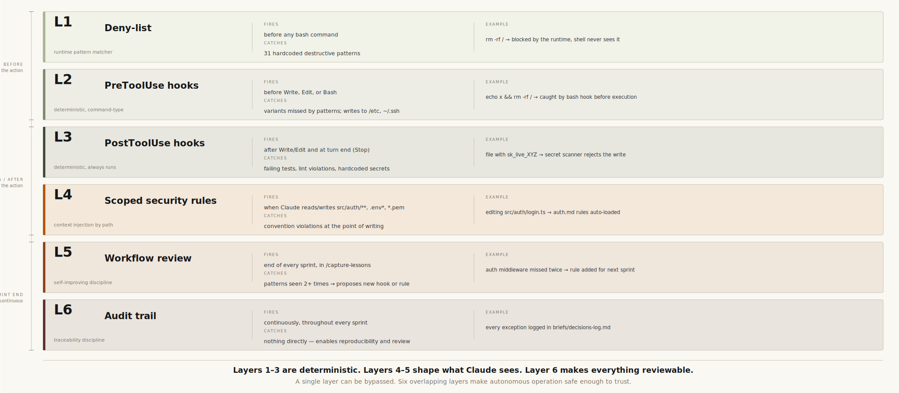

# Security Architecture — Claude Code Workflow

> **Version**: v4.0.0
> **Applies to**: All modes — interactive, headless (`claude -p`), and autonomous (strategic-pm)
> **Thesis**: This workflow applies defense-in-depth to operations Claude Code runs, reducing the risk of accidental destructive actions compared to an unguarded setup.

> **⚠ Disclaimer.** These layers harden Claude Code's local execution as much
> as we reasonably can. They are **not** a substitute for a properly
> architected secure environment — least-privilege credentials, network
> segmentation, secrets management, audit logging, and a real CI/CD review
> pipeline. The right model is *Claude Code's guards on top of a sound
> architecture*, not *guards instead of one*. If your underlying setup
> hands Claude write access to production with a god-mode token, no hook
> count will save you.

---

## What `--dangerously-skip-permissions` actually means

The flag bypasses **Claude Code's interactive approval prompts** — the dialogs
that ask "Allow this bash command? [y/n]". It does NOT:

- Bypass the `deny` list in `settings.json` — those patterns are always blocked
- Bypass command-type hooks (linter, test runner, secret scanner, PreToolUse guards) — those always run
- Give Claude access to anything it couldn't already access with your user account

It's called "dangerous" because it removes the human from each individual command
approval. The guards below replace that human with deterministic controls.

---

## What this workflow is NOT

**This workflow prevents automatic destructive actions. It does not prevent you
from explicitly authorizing them.**

If you tell Claude "run this AWS command" or "exceptionally, delete bucket X",
it will — because you authorized it. Claude then has the full authority of your
shell. The guards below stop *autonomous* execution without your consent, not
*authorized* execution at your instruction.

Think of it as an airbag: it protects against accidents, not against conscious
decisions. The correct workflow for authorized exceptions is documented in
[Working with authorized exceptions](#working-with-authorized-exceptions).

If you want 100% manual control: don't use autonomous mode, don't use
`--dangerously-skip-permissions`, approve each command interactively.
The workflow scales from "fully manual" to "fully autonomous" — you choose
your point on the spectrum per-sprint.

---

## The 6 layers of defense in depth

> A single layer can be bypassed. Six overlapping layers make autonomous operation safe enough to trust.



### Layer 1 — Deny-list (`settings.json` `permissions.deny`)

Hard-blocked patterns. Applied by the Claude Code runtime before any hook or LLM
evaluation. Cannot be bypassed by any flag or prompt injection.

| Category | Blocked patterns |
|----------|-----------------|
| File destruction | `rm -rf /`, `rm -rf ~`, `rm -rf .`, `rm -rf *` |
| Database | `DROP TABLE`, `DROP DATABASE`, `DELETE FROM`, `TRUNCATE` |
| Git destructive | `git push --force`, `git push -f`, `git push origin main/master`, `git reset --hard` |
| Permissions | `chmod 777`, `chmod -R 777` |
| Remote execution | `curl * \| sh`, `curl * \| bash`, `wget * \| sh` |
| Disk/system | `> /dev/sda`, `mkfs`, `dd if=`, `shutdown`, `reboot` |
| Publishing | `npm publish`, `pip upload` |
| Infrastructure | `terraform destroy`, `kubectl delete` |
| Git untracked | `git clean -f`, `git clean -fd` |
| Cloud storage | `aws s3 rm` |
| System scheduling | `crontab -r` |

**Why this matters:** An open terminal has none of these guards. A tired developer
or a copy-pasted script can run any of these. The deny-list is always on, even at
3am during an automated sprint. (31 patterns total — see `settings.json` for the
exact list.)

### Layer 2 — Deterministic PreToolUse hooks (command-type)

Four command-type hooks run a fast, deterministic check before any write or bash
command. No LLM involved — these are grep/case statements and small Python
scripts that always produce the same result for the same input.

**Why command-type, not prompt-type (LLM judge)?**

Prompt-type hooks spawn an LLM call to evaluate intent. In headless mode
(`claude -p --dangerously-skip-permissions`), this creates a blocking wait that
can hang for 25+ minutes with no timeout. Command-type hooks run in milliseconds
and are guaranteed to resolve. The v4 default still favors reliability over LLM
judgment.

> **For interactive sessions:** if you want an LLM judge in addition to these
> guards, add prompt-type hooks in `settings.local.json` (gitignored). They fire
> only in interactive sessions where a hang is visible and interruptible — no
> impact on headless runs.

**Write/Edit — system paths block** (inline shell): blocks writes to sensitive
system paths:
- `/etc/`, `/usr/`, `/var/`, `/System/`
- `~/.ssh/`, `~/.aws/`

**Write/Edit — `block_wiki_write.py`** (v4.0 — `.claude/hooks/`): blocks any
agent write under `wiki/**`. The wiki stays human-curated; agents propose new
pages via `briefs/wiki-proposals/<date>-<slug>.md`. The single legitimate path
through the gate is the `/wiki-review` skill, which creates the bypass sentinel
`.claude/.wiki-review-active` for the duration of the merge run and removes it
at end of run. Without this hook, automated capture would silently turn the
wiki into another conversation buffer (the failure mode the wiki exists to
prevent).

**Bash — command pattern block** (inline shell): grep-based block on a
secondary deny-list:
`rm -rf /`, `rm -rf ~`, `git push --force`, `git push -f`, `git reset --hard`,
`chmod 777`, `mkfs`, `dd if=`, `shutdown`, `reboot`. Overlaps intentionally
with Layer 1 — catches command variants the runtime deny-list might miss
(chained commands like `foo && rm -rf /`, subshells, etc.).

**Bash — `protect-uncommitted-hook.py`** (v4.0 — `.claude/hooks/`): blocks
destructive git commands when the worktree is dirty. Triggers on
`git checkout -- <path>`, `git restore <path>` (without `--staged`),
`git reset --hard`, `git stash drop|clear`, `git clean -f`, `git rm -f`. Allows
safe variants (`git restore --staged`, `git stash push|pop`,
`git reset --soft|--mixed`) and fail-opens on internal errors. Closes the
silent-overwrite incident pattern observed in auto-mode sessions where an
agent ran `git checkout main -- .` and erased uncommitted strategic-pm fixes
(2026-05-05). When the worktree is clean, all commands pass through unchanged.

**Why this matters:** Catches writes and commands that slip past the deny-list
pattern matcher, plus the two failure modes specifically surfaced in v3.x
production usage (silent wiki drift and uncommitted-work overwrite), without
introducing any headless-mode hangs.

### Layer 3 — Deterministic PostToolUse hooks

Three command-type hooks that always run, regardless of permissions mode:

| Hook | Event | What it enforces |
|------|-------|-----------------|
| **Stop** | Phase ends | Tests must pass — Claude cannot declare "done" with failing tests |
| **Linter** (PostToolUse) | After Write/Edit | Auto-lints JS/TS/Python after every file modification |
| **Secret scanner** (PostToolUse) | After Write/Edit | Blocks write if hardcoded secrets detected |

Secret scanner patterns (applied to source files — `.md`, `.txt`, `.example` files
and `.claude/` are excluded to avoid false positives):
- AWS access key IDs (`AKIA[0-9A-Z]{16}`)
- Stripe live secret keys (`sk_live_[a-zA-Z0-9]{20,}`)
- GitHub personal access tokens (`ghp_[a-zA-Z0-9]{30,}`)
- PEM private keys (`-----BEGIN PRIVATE`, `-----BEGIN RSA`)
- Generic hardcoded assignments (`(SECRET|PASSWORD|API_KEY)\s*=\s*[a-zA-Z0-9/+]{16,}`)

See the full regex in `.claude/settings.json` under the `PostToolUse` hook.

**Why this matters:** These run even if Claude "decides" the file is fine.
A hook doesn't reason — it executes. The secret scanner catches an accidentally
hardcoded key before it reaches a commit.

### Layer 4 — Scoped security rules (`.claude/rules/security/`)

Two rule files loaded automatically when Claude touches security-sensitive code:

- `security/auth.md` — loaded for `src/auth/**`, `**/*token*`, `**/*session*`
- `security/secrets.md` — loaded for `.env*`, `config/**`, `**/*.pem`, `**/*.key`

These rules are injected into Claude's context when it modifies matching files,
ensuring security conventions are applied at the point of writing — not discovered
later in review.

**Why this matters:** Claude doesn't need to be reminded "don't hardcode secrets"
globally. The rule activates exactly when it's relevant.

### Layer 5 — Workflow review step (`/capture-lessons` Step 4)

At the end of every sprint, the `/capture-lessons` skill includes a mandatory
"Review workflow configuration" step (Step 4) that evaluates:

- Bug class found 2+ times → propose a new hook to prevent it
- Reviewer flags a manual check → automate it as a hook
- New code area with specific patterns → create a scoped rule
- Manual step done 2+ times → create a skill

This means the security posture **self-improves with every sprint**. Each sprint
that finds a new class of issue automatically prompts adding a deterministic guard
for the next sprint.

### Layer 6 — Audit trail (`briefs/` + `decisions-log.md`)

Every strategic decision is logged in `briefs/decisions-log.md`. Sprint outputs
are preserved in `tasks/sprints/sprint-XX/`. This means:

- Full reproducibility: every change has a traceable decision chain
- In autonomous mode, `strategic-qa` independently reviews every sprint before the next one starts
- Blockers requiring human intervention are surfaced in `briefs/blockers.md`
- Nothing is silently discarded

---

## What this doesn't protect against

1. **Secrets already in the environment** — if `$STRIPE_SECRET_KEY` is set,
   Claude can read and use it. This is intentional (it needs to run the app).
   Scope your environment to only what the sprint needs.

2. **Novel destruction patterns** — the deny-list and PreToolUse hooks cover known
   patterns. A sufficiently creative command might bypass both. There is no LLM
   judge backstop by default (removed to fix headless hangs). Activate it in
   `settings.local.json` for interactive sessions if you want a second opinion.

3. **Exfiltration via legitimate channels** — Claude could theoretically send
   data via `curl` to a legitimate endpoint. Trust the model, audit `briefs/`
   and `decisions-log.md` if something looks off.

4. **Supply chain via dependencies** — `npm install` is not deny-listed. A malicious
   package could execute code at install time. Use `npm audit` (automated via
   scheduled tasks).

5. **Tampering with `.claude/` itself** — if someone modifies `settings.json`
   and removes the deny-list, all layers fall. Treat `.claude/` as
   security-sensitive code: review changes to it in PRs, consider a pre-commit
   hook that diffs against a known-good reference.

6. **Compromised agent or skill prompts** — a PR that modifies
   `.claude/agents/security-auditor.md` to skip certain checks is a security
   boundary violation. Agent prompts and skill files require the same review
   discipline as application code.

---

## Comparison: Claude workflow vs alternatives

| Guard | Open terminal | CI/CD pipeline | Claude workflow (v4.0.0) |
|-------|--------------|----------------|--------------------------|
| Deny-list (destructive cmds) | ❌ | Partial | ✅ 31 patterns |
| Deterministic PreToolUse hooks | ❌ | ❌ | ✅ 4 hooks, no hangs |
| Wiki write gate (`block_wiki_write.py`) | ❌ | ❌ | ✅ v4.0 |
| Uncommitted-work guard (`protect-uncommitted-hook.py`) | ❌ | ❌ | ✅ v4.0 |
| Tests must pass before "done" | ❌ | ✅ | ✅ |
| Secret scan on every write | ❌ | Optional | ✅ |
| Auto-lint on every write | ❌ | Optional | ✅ |
| Security rules at write time | ❌ | ❌ | ✅ |
| Decision rationale logged | ❌ | ❌ (logs actions, not reasons) | ✅ `decisions-log.md` |
| Self-improving security posture | ❌ | ❌ | ✅ |

---

## Per-stack guidance

### Node.js / TypeScript
- Secrets via `process.env.KEY` — the secret scanner blocks literal assignments
- `npm publish` is deny-listed — accidental registry pushes are impossible
- ESLint runs automatically after every file write

### Python
- Secrets via `os.environ['KEY']` or `python-dotenv` loading `.env`
- `pip upload` is deny-listed
- Ruff/flake8 runs automatically after every `.py` write

### AWS
- Use IAM roles — never put `AKIA...` keys in code (secret scanner blocks it)
- `aws s3 rm` is deny-listed — accidental bucket wipes are blocked
- Other destructive AWS operations (`aws ec2 terminate`, etc.) are not in the
  deny-list by default — add them to `settings.json` for your project if needed
- If you explicitly authorize Claude to run an AWS command, it will. See
  [Working with authorized exceptions](#working-with-authorized-exceptions).

### Stripe
- `sk_live_` keys blocked by secret scanner
- Use `sk_test_` in development, environment variables in production
- Stripe webhooks: `whsec_` secrets also covered by the scanner

### Docker
- `docker build` and `docker compose` are not restricted — use freely
- Base image pinning enforced by `rules/infra/cicd.md`
- Non-root container user enforced by the same rule

### Frontend only
- No backend secrets to protect — scanner still catches API keys in JS bundles
- `npm publish` deny-listed — no accidental CDN pushes

---

## Working with authorized exceptions

When you need Claude to perform an action the guards would normally block
(e.g., a one-off AWS cleanup, a force-push to a personal branch), the correct
pattern is:

1. **State the authorization explicitly**: "exceptionally, you may run
   `aws s3 rm s3://bucket-name` — this bucket is safe to delete"
2. **Confirm scope**: Claude should confirm the exact operation, mask sensitive
   values in command output, and never log secrets to `briefs/decisions-log.md`
3. **Log the exception**: append to `briefs/decisions-log.md` with rationale
   ("why was this exception needed, what was the risk, what was the outcome")
4. **Revert to default posture**: the authorization is scoped to the session.
   Don't leave standing exceptions open.

This is the audit trail. Exceptions are fine — undocumented exceptions are not.

---

## Verifying the setup

```bash
# Full setup health check
claude
> /doctor

# Inspect the deny-list manually
cat .claude/settings.json | grep -A 50 '"deny"'

# Test the secret scanner (do NOT commit this file):
# echo 'const API_KEY = "sk_live_fake123456789abcdefgh"' > /tmp/test.js
# The PostToolUse hook would block Claude from writing this to a source file
# rm /tmp/test.js  ← clean up after testing

# Manually verify a blocked command (documentation only — do NOT run):
# git push origin main       → blocked by deny-list
# rm -rf .                   → blocked by deny-list
# terraform destroy          → blocked by deny-list
```

---

## v3.5.1 — Hotfix notes

Two operational security fixes shipped in v3.5.1:

- **Session semantics clarification**: the strategic-pm previously misread
  "one phase = one session" as a human approval gate between phases, causing
  it to pause unnecessarily. This is a process security issue — a PM that skips
  validations because it misread a rule breaks the audit trail. Fixed in
  `.claude/agents/strategic-pm.md`.

- **Plan mode silent failure**: plan mode wasn't consistently activated during
  complex sprint planning, leading to premature edits. Fixed in
  `.claude/skills/sprint-plan/SKILL.md`.
