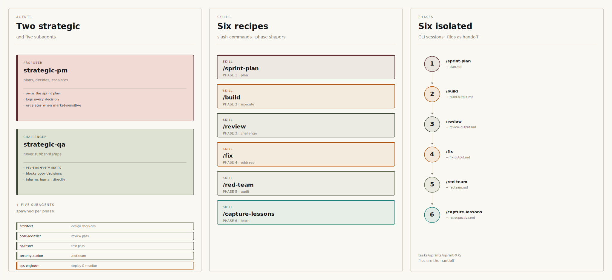
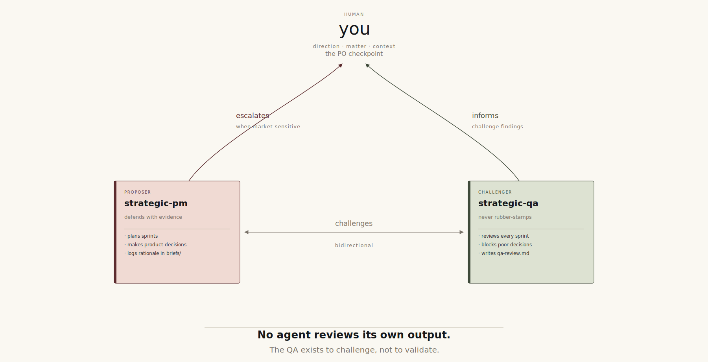
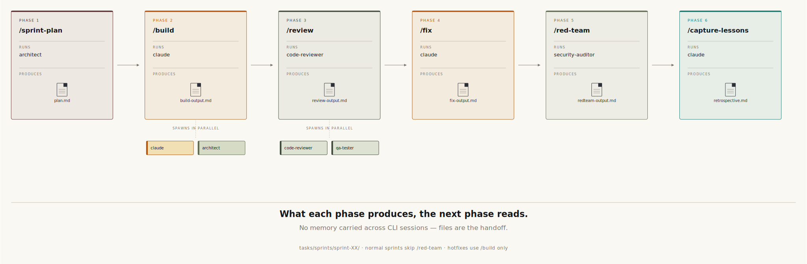
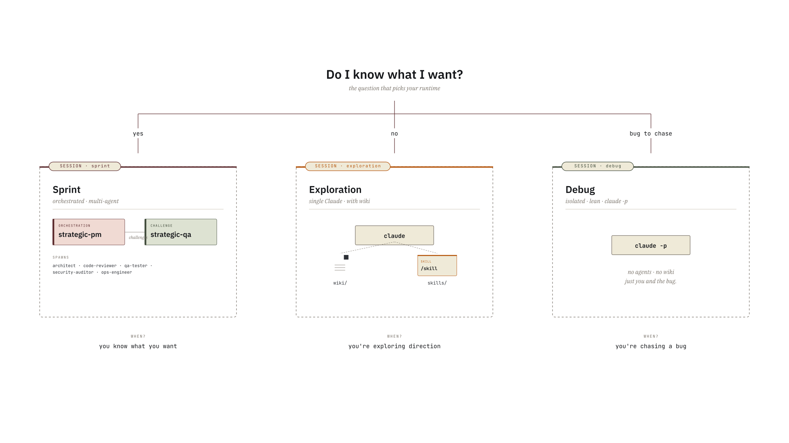
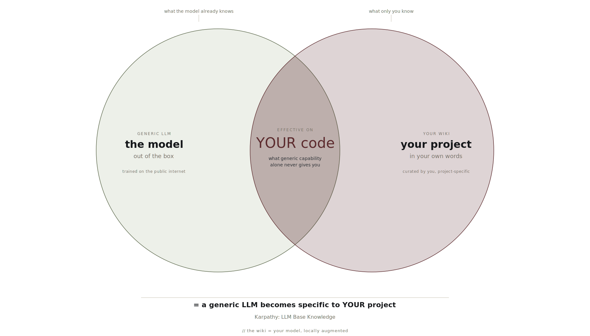

# Development Workflow with Claude Code

> **Version**: 4.1.0 — June 2026
> **For**: Developers building production software with Claude Code, solo or in small teams
> **Philosophy**: Keep it simple. The human invokes and validates. Claude executes.

---

## Table of Contents

1. [Philosophy](#1-philosophy)
2. [The Agent System](#2-the-agent-system)
3. [The Sprint Cycle](#3-the-sprint-cycle)
4. [Bootstrapping a New Project](#4-bootstrapping-a-new-project)
5. [Project Architecture](#5-project-architecture)
6. [Claude Code Mechanisms — Reference](#6-claude-code-mechanisms--reference)
7. [Marketing Workflow](#7-marketing-workflow)
8. [Scheduled Tasks & Monitoring](#8-scheduled-tasks--monitoring)
9. [Remote Operations](#9-remote-operations)
10. [Working as a Pair](#10-working-as-a-pair-for-teams--solo-devs-can-skip)
11. [FAQ](#11-faq)
12. [Glossary](#12-glossary)

---

## 1. Philosophy

### The Problem We Solve

Without structure, three things happen with Claude Code:

- **Claude drifts.** Long conversations get compacted, instructions disappear, code no longer meets standards.
- **No traceability.** Each session is an island. You no longer know what was decided, why, or where things stand.
- **No systematic quality.** The temptation to build → ship without review or testing.

### The Solution in One Sentence

A structured sprint cycle where **skills encode the workflow** and **the human only does two things: invoke and validate**.

If you find yourself copy-pasting a prompt or manually dictating steps to Claude, that's a workflow bug. It should be in a skill.

### The 8 Principles

1. **Plan first.** Never code without a plan. If things go off track, stop and re-plan.
2. **Subagents for everything specialized.** Isolate concerns, keep the main context clean.
3. **Capitalize on every mistake.** Update `lessons.md` after every correction. Memory-enabled agents complement this capitalization automatically.
4. **Prove before declaring "done".** Tests, logs, demo. Hooks enforce this.
5. **Balanced elegance.** Neither hacks nor over-engineering.
6. **Claude is autonomous within the phase.** Don't micro-manage. Give scope and context, Claude does the rest.
7. **Simplicity first.** The simplest change that works. Always.
8. **Revisit regularly.** Skills and agents must evolve with model capabilities. Every 2-3 months, review directive instructions — if the model naturally does what the skill tells it, simplify. Gotchas and business context are more durable than rigid steps. (Source: Anthropic feedback — "as models improve, tools that once helped may now constrain them.")

### What We Do NOT Do

- **No autonomous orchestrator by default.** Until you have 3+ successful manual sprints, the human validates between each phase. After that, the autonomous sprint type delegates phase chaining to the `strategic-pm` agent — but the human still validates the final PR. Autonomy is within a sprint, not instead of validation.
- **No micro-management.** We don't tell Claude which vulnerabilities to look for, which code pattern to use, or which files to read. Skills and agents have that intelligence.
- **No Claude Desktop as main tool.** Reserved for deep research and marketing. For dev: everything in Claude Code.

### Adaptations to Opus 4.8

Several decisions in v4.0 are direct consequences of running this workflow on Opus 4.8. They are listed here so the rationale doesn't get buried under the diff.

- **Positive examples in agent prompts.** Each agent's behavioral section opens with its role explicitly named (e.g., *"Your role — reviewer, not fixer"*) and states what to do in active voice. Negative phrasing (*"don't do Y"*) generalizes worse on the new model — it leaves ambiguity at the edges where the model has to decide what falls under "Y is forbidden". Active voice removes that ambiguity. (See CHANGELOG: *Q14 prompt refactor*.)
- **`/effort high` enabled by default.** The strategic agents reason at `effort: high` because the gain in plan and review quality is large at the latency we accept for sprint orchestration.
- **`--bare` removed from `full-sprint`.** The `claude -p --bare` SDK path was ~10× faster to start, but it skipped hooks, broke Max OAuth, and missed `CLAUDE.md` autoload. With v4.0 introducing hooks you actively want to fire (`block_wiki_write`, `protect-uncommitted`, secrets scan), the trade is no longer worth it. Plain `claude -p` keeps every guarantee.
- **Cache hygiene over context size.** `CLAUDE_AUTOCOMPACT_PCT_OVERRIDE=80` (auto-compact at 80% instead of 95%) and `CLAUDE_CODE_DISABLE_1M_CONTEXT=1` (1M window off) — fresh sessions on a stable prefix beat saturated sessions on a giant window. The model degrades silently past ~80%; we just don't go there.
- **Post-sprint boundary.** A new session starts after `/capture-lessons`. Long-lived context lives in `briefs/project-state.md` and `tasks/lessons.md`, not in conversation history. The wiki and the briefs *are* the memory; the conversation is the working window.
- **Memory per agent stays scoped.** `strategic-pm` does not carry `code-reviewer`'s memory. Each role keeps its own focused memory; misuse them and you re-introduce the drift that the structure is meant to remove.

These five adaptations together are what kept the workflow stable through May 2026's release. They are not a polish layer — remove them and the same prompts produce noticeably worse output on the same model.

---

## 2. The Agent System



### Structure: 9 agents shipped

| Layer | Agents | When to use |
|-------|--------|-------------|
| **Technical (6)** | `architect`, `code-reviewer`, `security-auditor`, `qa-tester`, `ops-engineer`, `ops-monitor` | From sprint 1 — cover any project type |
| **Strategic (2)** | `strategic-pm`, `strategic-qa` | Activate after 3+ successful manual sprints |
| **Marketing (1)** | `marketing-strategist` | When user-facing communication or product positioning is involved |
| **Optional slot (+1)** | Project-specific (`ml-engineer`, `ui-designer`, etc.) | 9 agents ship by default. Create this only when a real need emerges after 2-3 sprints. |

Each agent consumes context via its description. The six technical agents cover any project type from day 1 — the three orchestration agents (strategic-pm, strategic-qa, marketing-strategist) run in separate sessions (`claude --agent=strategic-pm`) so they don't add to the main session budget.

### Capitalization: The Dual Mechanism

`tasks/lessons.md` is the **main capitalization mechanism**. Structured, versioned, read by each skill at the start of every phase. It's the project's explicit memory.

In addition, agents with `memory: project` accumulate organic context between sessions — recognized patterns, typical errors, past decisions. This dual mechanism (explicit + organic) reinforces itself and will gain in power with Anthropic updates.

### Agent Configuration

| Agent | Domain | Model | Model Justification |
|-------|--------|-------|---------------------|
| `architect` | System design, technical planning, architecture | Opus | Complex reasoning, few invocations |
| `code-reviewer` | Code quality, conventions, perf, readability | Opus | Maximum rigor on reviews |
| `security-auditor` | Application security, vulnerabilities, pentesting | Opus | Adversarial reasoning |
| `ops-engineer` | CI/CD, infra, deploy, monitoring, costs | Opus | Quality-first across the board |
| `qa-tester` | Test strategy, edge cases, regression | Opus | Quality-first across the board |
| `marketing-strategist` | Positioning, copy, SEO, CRO, user feedback | Opus | Strategic judgment, positioning decisions |
| `strategic-pm` | Autonomous sprint orchestration, product decisions | Opus | Complex judgment, orchestrates full sprints |
| `strategic-qa` | Tech lead challenge, sprint quality review | Opus | Adversarial review of PM decisions |
| `ops-monitor` | Monitoring triage, first responder, diagnostics | Opus | Quality-first across the board |

> **Model doctrine**: all agents run on Opus; the mechanical skills inherit the session model (no `model:`/`effort:` declared). This is a quality-first choice we own — no Sonnet routing. If you need to cap consumption, lower the session model or add `model:` to the agents you invoke most, but the shipped default is Opus everywhere.

All agents have `memory: project` enabled.

#### `architect`

Invoked during sprint planning and structural technical decisions. Produces plans, challenges approaches, evaluates trade-offs. The `/sprint-plan` skill relies on it. Tools: Read, Grep, Glob, Bash (read-only recommended).

#### `code-reviewer`

Invoked during the review phase. Reviews like a senior staff engineer. Knows project conventions via CLAUDE.md and rules. Tools: Read, Grep, Glob (read-only — it reviews, it doesn't fix).

#### `security-auditor`

Invoked during the red team phase. We do NOT tell it what to look for — we give it scope and business context, it attacks freely. Its memory means the more it audits the project, the better it knows the attack surfaces and past security decisions. Tools: Read, Grep, Glob, Bash (sandboxed).

#### `ops-engineer`

Invoked for CI/CD, Dockerfiles, Terraform, monitoring, cost optimization. Covers DevOps, SRE and FinOps. Tools: Read, Grep, Glob, Bash, Edit.

#### `qa-tester`

Invoked after the build and during review. Doesn't just run existing tests — identifies missing edge cases, regression scenarios, fragile areas. Tools: Read, Grep, Glob, Bash, Edit, Write.

### The `marketing-strategist`

A peer of the PM — not a subordinate. Owns market direction (positioning, messaging, conversion) while the PM owns technical direction. Communicates with the PM via `briefs/`. See [Section 7](#7-marketing-workflow) for the full marketing workflow.

### The Strategic/Ops Layer



These three agents operate in dedicated sessions (`claude --agent=<name>`), not as subagents of the main session:

#### `strategic-pm`

Autonomous sprint orchestrator. Plans sprints, chains phases via `claude -p`, updates `briefs/project-state.md`. Uses PROPOSER persona — defends decisions with evidence. Activate after 3+ successful manual sprints so it has project history in `tasks/lessons.md`.

#### `strategic-qa`

Tech lead challenger. Reviews completed sprints, challenges PM decisions independently, writes `briefs/qa-review.md`. Uses TROUBLEMAKER persona — never rubber-stamps. Neither agent reviews its own work: structural guarantee of independent challenge.

#### `ops-monitor`

First responder for ops issues. Reads monitoring outputs in `monitoring/`, triages alerts, recommends severity. Used in the remote ops workflow (see Section 9).

### The 1 Remaining Optional Slot

One slot remains for a project-specific agent: `ml-engineer`, `data-architect`, `ui-designer`, `api-designer`... Only create it when the need is proven after 2-3 sprints — not "just in case".

---

## 3. The Sprint Cycle



### Three session types — pick before you start



Before you choose *which* sprint type, you choose *how* you'll work with Claude this time. Three modes, picked by what you walk in with:

| Session | When you use it | Mode of interaction |
|---------|-----------------|---------------------|
| **Sprint** | You know what you want shipped | Orchestrated. PM agent or manual cycle, structured artefacts (`tasks/sprints/sprint-XX/*`), CI in the loop |
| **Exploration** | You don't yet know what you want | Open dialogue with Claude in a regular session. Wiki + skills are available, no skill is invoked end-to-end |
| **Debug** | A specific bug to chase | Isolated `claude -p` session. Narrow scope, fast iteration, no sprint artefacts |

The mental rule, said quickly: *"Do I know what I want? Yes → sprint. No → exploration. Bug to chase → debug."* These map to the three columns of the diagram above; "sprint type" (next subsection) is the further subdivision *inside* the sprint mode.

### Sprint Types

Not everything warrants the full cycle. Before starting, choose the right type:

| Type | Phases | When to Use |
|------|--------|-------------|
| **Hotfix** | `/build` → deploy | Prod bug, < 3 files, urgent |
| **Normal** | `/sprint-plan` → `/build` → `/review` → `/fix` → `/capture-lessons` | Standard feature sprint, 1-2 days |
| **Security** | `/sprint-plan` → `/build` → `/review` → `/fix` → `/red-team` → `/capture-lessons` | Pre-release, changes to auth/billing/sensitive data |
| **Autonomous** | `/full-sprint` or `claude --agent=strategic-pm` | PM chains all phases unattended. Human validates final output only. Prerequisite: 3+ successful manual sprints. See FAQ for design rationale. |

The **security sprint** is the full cycle. The **normal sprint** skips the red team. The **hotfix** is a fast-track build → deploy. The **autonomous sprint** delegates orchestration to the PM agent — use only after the manual cycle is well understood and the project has history in `tasks/lessons.md`. Adapt the process to the stakes, not the other way around.

### Overview

```
Security sprint (full cycle):
  /sprint-plan  →  /build  →  /review  →  /fix  →  /red-team  →  /capture-lessons
       │              │            │           │          │              │
    Human:         Human:      Human:      Human:     Human:         Human:
    validates      validates   triages     validates  validates      validates
    the plan       the build   issues      the fixes  security       the retro
                                                      report

Normal sprint: same cycle, /red-team omitted.
Hotfix: /build → deploy only.
```

**What the human does**: invoke the skill (`/name`) + validate/adjust the result.
**What the skill does**: everything else.

### Phase 1 — Sprint Planning

```
Human types: /sprint-plan
```

**What the skill does automatically:**
1. Reads `tasks/backlog.md`, `tasks/lessons.md`, and the latest retrospective
2. Switches to plan mode (read-only)
3. Invokes the `architect` subagent to analyze and propose a plan
4. Produces a structured plan: tasks, acceptance criteria, dependencies, risks
5. Self-challenges: plays devil's advocate, identifies weaknesses and alternatives
6. Saves `tasks/sprints/sprint-XX/plan.md`

**What the human does:**
- Reads the plan, adjusts if needed, validates

**What if I don't have the expertise to challenge the plan?** The skill encodes self-challenge (step 5). The `architect` agent has memory of previous sprints — it flags inconsistencies. And the review phase catches what planning missed. The plan doesn't need to be perfect.

### Phase 2 — Build

```
Human types: /build
```

**What the skill does automatically:**
1. Reads the sprint plan and `tasks/lessons.md`
2. For each task: evaluates complexity, plan mode if > 3 files, implements, tests
3. If Agent Teams available and tasks parallelizable: parallelizes (frontend + backend + tests). Otherwise: sequential — the result is the same, the speed changes.
4. Manages context: compacts if needed, flags if a session split is recommended
5. Saves `tasks/sprints/sprint-XX/build-output.md`
6. Signals "build complete"

**What the human does:**
- Waits for the notification, checks the build-output, validates

> The `Stop` hook guarantees Claude won't declare "done" without tests passing.

### Phase 3 — Review

```
Human types: /review
```

**What the skill does automatically:**
1. Reads `build-output.md`
2. Launches the review:
   - **By default**: `code-reviewer` subagent + `qa-tester` subagent sequentially
   - **If Agent Teams available**: parallelizes code-reviewer + qa-tester + security-auditor (first scan)
3. Consolidates into `tasks/sprints/sprint-XX/review-output.md`, classified by severity (critical → suggestion)

**What the human does:**
- Reads the review-output, triages (fix / defer / ignore), validates

### Phase 4 — Fix

```
Human types: /fix
```

**What the skill does automatically:**
1. Reads `review-output.md` (triaged by the human)
2. Fixes issues marked "to fix" — plan mode if fix is complex, tests each fix
3. Saves `tasks/sprints/sprint-XX/fix-output.md`

**What the human does:**
- Checks the fix-output, validates

### Phase 5 — Red Team *(security sprint only)*

```
Human types: /red-team
```

**What the skill does automatically:**
1. Reads the plan and build-output for scope and business context
2. Invokes `security-auditor` in sandbox
3. The agent attacks freely — no checklist, no directives. It has its expertise, its memory, the context. It's a pentester, we give it scope.
4. Produces `tasks/sprints/sprint-XX/redteam-output.md` classified by criticality
5. Immediately fixes critical vulnerabilities
6. Adds minor ones to the backlog

**What the human does:**
- Reads the report, validates critical fixes, decides on treatment of minor ones

### Phase 6 — Ship & Capture

```
Human types: /capture-lessons
```

**What the skill does automatically:**
1. Creates the PR with a description based on sprint artifacts
2. Updates `tasks/lessons.md` with learnings
3. Generates `tasks/sprints/sprint-XX/retrospective.md`
4. Updates `tasks/backlog.md`

**What the human does:**
- Reviews the retro, merges the PR, moves to the next sprint
- If user-facing changes shipped: run `/marketing-sync` to sync marketing context and produce communication drafts

### What Is Encoded and Where

Best practices aren't advice — they're in the code:

| Best Practice | Encoded In |
|--------------|------------|
| Plan mode before coding if complex | Skill `/build` (internal logic) |
| Mandatory tests before "done" | Hook `Stop` |
| Linter after every modification | Hook `PostToolUse` |
| Read lessons at start of phase | Every skill (first instruction) |
| No dangerous commands | Hook `PreToolUse` + Sandbox |
| Mandatory cross-review | Convention in CLAUDE.md |
| Prove it works | Hook `Stop` |

---

## 4. Bootstrapping a New Project

### What You Do Once

```bash
# 1. Clone the template
cp -r path/to/claude-project-template/ my-new-project/
cd my-new-project/ && git init

# 2. Launch Claude Code and verify
claude
> /init           # Bootstrap CLAUDE.md
> /doctor         # Check config
> /context        # Check context usage
```

### What the Template Contains

```
claude-project-template/
├── .claude/
│   ├── CLAUDE.md               # To customize
│   ├── settings.json           # Pre-configured hooks
│   ├── agents/                 # 9 agents: 6 technical (day 1) + 2 strategic (after 3+ sprints) + 1 marketing
│   ├── skills/                 # 19 skills (6 cycle + 2 autonomous + 1 wiki + 5 ops + 3 marketing + 2 setup)
│   └── rules/general.md        # Base conventions
├── briefs/                     # Shared agent memory
│   ├── marketing-context.md    # Template to populate via /marketing-sync
│   ├── marketing-directive.md  # Template, filled per sprint
│   └── user-feedback.md        # Template, add raw feedback and sync
├── content/                    # Marketing output (human publishes)
│   ├── changelog/
│   ├── social/
│   ├── emails/
│   └── releases/
├── tasks/
│   ├── backlog.md              # Empty, to fill
│   ├── lessons.md              # Empty, fills up over time
│   └── sprints/
├── .gitignore
└── docs/WORKFLOW.md            # This document
```

### Marketing Setup (one-time per project)

Run `/marketing-sync` (Mode 4) to generate `briefs/marketing-context.md` from your product vision.

### Customize at the Start of the Project

| File | What to Do |
|------|-----------|
| `.claude/CLAUDE.md` | Product vision, stack, critical conventions |
| `.claude/rules/general.md` | Code conventions (naming, patterns) |
| `.claude/rules/` | Add scoped subdirectories if needed |
| `tasks/backlog.md` | Initial product backlog |

The agents and cycle skills **work out of the box** at startup.

### Create or Modify During the Project

| What | When |
|------|------|
| **New skill** | Task done > 2 times manually → `/skill-creator` |
| **Optional agent** (6th/7th) | Proven need after 2-3 sprints, not "just in case" |
| **New scoped rule** | New code area with specific conventions |
| **Additional hook** | Recurring problem requiring a deterministic guarantee |
| **CLAUDE.md** | When the vision or stack evolves. Rarely. |
| **lessons.md** | After every sprint (automated) + after every significant human correction |

### What You Don't Touch

The cycle skills should not be modified during a project. If a skill isn't working well, the problem is usually in CLAUDE.md (insufficient context) or rules (missing conventions). Exception: recurring failure pattern after several sprints → thoughtful adjustment.

### Starting Autonomous Mode

The strategic layer (PM + QA agents) enables autonomous sprint orchestration. Enable it after the manual cycle is solid.

**Prerequisites:**
1. 3+ successful manual sprints completed — PM agent needs project history in `tasks/lessons.md`
2. `briefs/direction.md` written — product vision, current milestones, constraints
3. `briefs/project-state.md` up to date — current technical state

**To start a sparring / planning session with the PM:**
```bash
claude --agent=strategic-pm
```
The PM reads `briefs/direction.md`, proposes a sprint plan, writes `briefs/sprint-directive.md`. You validate or push back. When ready, the PM can execute the sprint autonomously via `/full-sprint`.

**After each autonomous sprint, run the QA:**
```bash
claude --agent=strategic-qa
```
The QA reads all sprint output files, challenges PM decisions independently, writes `briefs/qa-review.md`. The PM reads this before planning the next sprint. Neither agent reviews its own work — that's the structural guarantee.

See `.claude/agents/strategic-pm.md` and `.claude/agents/strategic-qa.md` for their full instructions and debate protocol.

---

## 5. Project Architecture

### Why the structure looks like this

The most common question when someone first opens the template: *"why this layout, why these folders?"*. The answer is that each folder solves a specific problem, and removing one re-introduces a failure mode the workflow exists to prevent.

| Folder | Problem it solves |
|--------|------------------|
| `.claude/CLAUDE.md` | Drift across sessions. Read at the start of every session — the project's spine. The contract any agent honours regardless of which session opens it. |
| `.claude/agents/` | One generalist trying to be PM, reviewer, security auditor and ops engineer at once → none of those well. One file per role, scoped tools, scoped memory. |
| `.claude/skills/` | Repeating the same prompt sequence by hand → bug-prone, slow, lossy. A skill is the recipe, written once, reusable. |
| `.claude/hooks/` | "I told you not to do that" doesn't scale. A hook is a deterministic guard that doesn't depend on the model remembering the rule. |
| `.claude/rules/` | One global instruction file becomes contradictory ("be terse here / be verbose there"). Path-scoped rules apply only when relevant. |
| `briefs/` | Cross-session memory the agents share. Not conversational state — explicit artefacts. Survives compaction, survives `/clear`, survives a fresh CLI process. |
| `tasks/sprints/sprint-XX/` | Phase handoff. Each phase reads what the previous phase wrote, in a file with a known name. No "did you save the plan?" — the file is the contract. |
| `wiki/` | Project-specific knowledge that's stable enough to be canonical. The model's base knowledge plus this wiki = a model that actually knows your project. Curated by humans (see §6 — *Wiki — your model adapted*). |

The structure isn't aesthetic. Remove `briefs/` and the strategic-pm has nowhere to land its decisions; remove `tasks/sprints/sprint-XX/`, the phases lose their handoff; remove `.claude/hooks/`, the deny-list becomes the only mechanical guard. Each folder is load-bearing.

### File Structure

```
my-project/
├── .claude/
│   ├── CLAUDE.md                    # Source of truth — ~100 lines max
│   ├── CLAUDE.local.md              # Personal preferences (gitignored)
│   ├── settings.json                # Hooks, permissions, shared config
│   ├── settings.local.json          # Local config (gitignored)
│   ├── agents/                      # 9 shipped: 5 universal + 3 strategic/ops + 1 marketing + 1 optional slot
│   │   ├── architect.md
│   │   ├── code-reviewer.md
│   │   ├── security-auditor.md
│   │   ├── ops-engineer.md
│   │   ├── qa-tester.md
│   │   ├── strategic-pm.md          # Autonomous sprint orchestration (activate after 3+ sprints)
│   │   ├── strategic-qa.md          # Tech lead challenger for autonomous sprints
│   │   ├── ops-monitor.md           # Ops triage and first responder
│   │   └── marketing-strategist.md  # Peer of the PM — market direction
│   ├── skills/                      # 19 skills — see Section 6 for full breakdown
│   │   ├── sprint-plan/             # Cycle
│   │   ├── build/
│   │   ├── review/
│   │   ├── fix/
│   │   ├── red-team/
│   │   ├── capture-lessons/
│   │   ├── full-sprint/             # Autonomous
│   │   ├── update-briefs/
│   │   ├── changelog/               # Marketing
│   │   ├── marketing-sync/
│   │   └── frontend-slides/
│   └── rules/                       # Conventions scoped by file
│       ├── general.md
│       ├── backend/
│       ├── frontend/
│       └── security/
├── briefs/                          # Shared memory between agents
│   ├── project-state.md             # Technical state (PM → Marketing)
│   ├── marketing-context.md         # Positioning, audience, tone (Marketing)
│   ├── marketing-directive.md       # Sprint marketing plan (Marketing → PM)
│   ├── user-feedback.md             # Structured feedback analysis (Marketing)
│   └── decisions-log.md             # Strategic decisions log
├── content/                         # Marketing output (human publishes)
│   ├── changelog/                   # Generated by /changelog
│   ├── social/                      # Social media posts
│   ├── emails/                      # Email sequences and campaigns
│   └── releases/                    # Release notes and announcements
├── tasks/
│   ├── backlog.md
│   ├── lessons.md
│   └── sprints/
│       └── sprint-XX/
│           ├── plan.md
│           ├── build-output.md          # Solo: standard name
│           ├── review-output.md         # Pair: prefix with a- / b- (see Section 10)
│           ├── fix-output.md
│           ├── redteam-output.md
│           └── retrospective.md
└── src/
```

### Which File Does What — In Brief

| File | Role | When It Is Read |
|------|------|-----------------|
| `CLAUDE.md` | Vision, stack, critical conventions | Automatically, every session |
| `CLAUDE.local.md` | Personal preferences | Automatically, every session |
| `.claude/rules/*` | Detailed conventions, scoped by path | When Claude touches a matching file |
| `.claude/agents/*` | Specialized expertise with memory | When invoked (auto or explicit) |
| `.claude/skills/*` | Automated workflows per phase | Via `/skill-name` |
| `settings.json` | Hooks, permissions | Automatically, every session |
| `tasks/lessons.md` | Knowledge capital (main mechanism) | Read by skills at the start of each phase |
| `tasks/sprints/sprint-XX/*` | Handoff between phases | Read by the next phase's skill |
| `briefs/project-state.md` | Technical state summary (PM → Marketing) | Read by `/marketing-sync` |
| `briefs/marketing-context.md` | Positioning, audience, tone | Read by `marketing-strategist` and `/changelog` |
| `briefs/user-feedback.md` | Structured user feedback | Read by `/marketing-sync`, flagged to PM |
| `content/*` | Marketing output drafts | Human reviews and publishes |

---

## 6. Claude Code Mechanisms — Reference

> This section is a **quick reference**. Come back to it when you wonder "how does this work?". For full documentation: [docs.anthropic.com](https://docs.anthropic.com).

### CLAUDE.md — Persistent Memory

Markdown file read at the start of every session. Never compacted — this is what solves Claude Desktop's drift problem. Recommended max size: ~100-120 lines. Beyond that, Claude skims. Contains the vision, stack, essential conventions, and pointers to rules/skills. Commands: `/init` to bootstrap, `/memory` to edit.

The `CLAUDE.local.md` is the personal version (gitignored): your interaction preferences.

### Wiki — your model adapted



The wiki is not a notepad. It is the project-specific extension of the model's base knowledge — the framing comes from Andrej Karpathy's *LLM Knowledge Bases* thread (see [karpathy.ai](https://karpathy.ai)).

- The generic model knows the public internet — every framework, every common pattern, the shape of the language.
- The wiki adds what is yours — domain rules, recurring incidents, the specific reason this codebase makes the choices it makes, terminology that exists nowhere else.
- Together, they form a model that actually knows *your* project. Not a model retrained, not a model fine-tuned: a model with a curated companion knowledge base.

The wiki is **human-curated** by design. Agents propose new pages via `briefs/wiki-proposals/<date>-<slug>.md`. The `block_wiki_write.py` PreToolUse hook physically prevents direct agent writes; the only legitimate path is the `/wiki-review` skill, which walks each proposal with the human (merge / rewrite / discard / defer) and creates the bypass sentinel `.claude/.wiki-review-active` for the duration of the review. This is deliberate — auto-ingested wiki content drifts into the wiki being just another conversation buffer. We kept it canonical.

If the wiki is empty, the workflow still works — you fall back on the model's base knowledge plus what's in `CLAUDE.md`. As the wiki grows, your sprints and explorations get steadily sharper because the answer to *"how does this project handle X?"* is in the project, not in a paragraph the model interpolated from training data.

### Rules — Scoped Conventions

Markdown files in `.claude/rules/` loaded automatically based on **path scoping**:

```yaml
# .claude/rules/security/auth.md
---
paths:
  - "src/auth/**"
  - "src/crypto/**"
---
# Security Rules — Auth & Crypto
- bcrypt cost factor >= 12
- JWT expires after 15 min max
```

When Claude touches `src/auth/`, these rules load. When it works on `src/components/Button.tsx`, they don't. Clean context, relevant conventions.

### Subagents — Specialized Experts

Markdown files in `.claude/agents/`. Each agent has its own context (doesn't pollute the main thread), its system prompt, its allowed tools, and optionally **persistent memory** (`memory: project`).

Memory allows the agent to accumulate knowledge between sessions — codebase patterns, past decisions, previous errors. Combined with `lessons.md` read by skills, this creates a dual capitalization mechanism: one structured (lessons.md), one organic (agent memory). Both complement each other and will gain in effectiveness with Anthropic updates.

Invocation: automatic (Claude delegates when the description matches) or explicit. Command: `/agents`.

### Skills — Automated Workflows

Folders in `.claude/skills/` with a `SKILL.md`. Invocable via `/skill-name`. **Progressive disclosure**: only the frontmatter (~100 tokens) is permanently in context, the content loads on invocation. Full skills reference: [code.claude.com/docs/en/skills](https://code.claude.com/docs/en/skills).

**19 skills total**, grouped by purpose:

| Group | Skills (6+2+1+5+3+2) |
|-------|-------------------|
| **Cycle (6)** | `sprint-plan`, `build`, `review`, `fix`, `red-team`, `capture-lessons` |
| **Autonomous (2)** | `full-sprint`, `update-briefs` |
| **Wiki curation (1)** | `wiki-review` |
| **Operations (5)** | `smoke-test`, `runbook`, `remote-fix`, `monitoring-briefing`, `data-analysis` |
| **Marketing (3)** | `changelog`, `marketing-sync`, `frontend-slides` |
| **Setup (2)** | `scaffolding`, `product-verification` |

All 19 ship with the template. Use what fits your project.

- **During the project**: whenever a task is done manually more than twice → `/skill-creator`

### Hooks — Deterministic Guarantees

Commands that execute at precise points in the lifecycle. Unlike natural language instructions, a hook **always executes**.

"Always run tests" in a CLAUDE.md → wish.
A `Stop` hook that runs tests → guarantee.

Two types: **command** (shell script, deterministic) and **prompt** (an LLM judges yes/no — for checks requiring judgment).

| Event | Our Usage |
|-------|-----------|
| `PostToolUse` (Write/Edit) | Automatic linter after every modification |
| `Stop` | Mandatory tests before Claude declares "done" |
| `PreToolUse` (Bash) | Block dangerous commands |
| `Notification` | Desktop alerts when Claude awaits validation |

Config: `/hooks` (interactive) or `settings.json`.

### Hooks and headless mode

When running `claude -p` (headless mode), use the
`--dangerously-skip-permissions` flag. Despite its name, the deny-list
in settings.json still blocks destructive commands.

The PreToolUse hook is configured to approve `claude -p` commands as
part of the normal sprint workflow (PM agent launching build phases, etc.).

Quick reference:
- Interactive (terminal): all hooks active, no flag needed
- Headless (`claude -p`): add `--dangerously-skip-permissions`
- PM agent launching sprints: works from within a Claude Code session

If a hook blocks a legitimate command, the human copies and runs it
directly in the terminal as a fallback.

### Context Management — Concrete Rules

Context is the most critical resource. Here are the rules:

- **One phase = one isolated CLI session.** Each phase runs in its own `claude -p` to avoid context pollution. This is **technical** isolation, not a human approval gate. In manual mode, the human opens a new session between each phase. In autonomous mode, the strategic-pm chains these sessions without PO intervention. Handoff goes through files in `tasks/sprints/sprint-XX/`.
- **Monitor**: `/context` to see usage.
- **If the build exceeds ~60% of context**: compact (`/compact`) or split into 2 sessions with intermediate handoff via `build-output.md`.
- **Recommended max sprint size**: 5-8 modified files. Beyond that, split into subtasks with separate sessions.
- **New session = clean context.** This is intentional: a review session without build context produces a more critical review.
- **Name sessions**: `/rename sprint-03-build-auth` to retrieve via `/resume`.

The "60% rule" comes from empirical community feedback (not from official Anthropic docs). In practice: beyond that, quality degrades. Skills handle compaction automatically, but stay vigilant.

### Prompt Caching — Why It Matters

CLAUDE.md, rules, and tool definitions are cached by Claude Code's prompt cache. Every modification to CLAUDE.md invalidates the cache for ALL active sessions in the project. That's why we only modify CLAUDE.md for vision or stack changes, never for tactical adjustments. For tactical adjustments: `rules/` (loaded only when Claude touches matching paths — no cache impact on other files) or `tasks/lessons.md` (read at the start of each phase by every skill).

**Compact vs Clear**: within a phase, always `/compact` — it preserves the prefix cache (system prompt, tools, CLAUDE.md). Between two sprint phases, `/clear` or new session — fresh context is intentional (a review must not be biased by the build). The cost of cache rebuild is the price of quality.

**Never switch models mid-session.** The prompt cache is unique per model. Switching from Opus to Haiku mid-session rebuilds the entire cache — it's more expensive than staying on Opus. To use a different model, go through a subagent with an explicit `model:` field (our agents all run on Opus by default).

**Never add or remove tools mid-session.** Tool definitions are part of the cached prefix — the same rule as model changes. Adding or removing an MCP server, changing permissions, or modifying tool availability while a session is running invalidates the cache. For tool changes: open a new session.

### Agent Teams — Parallelism

Multiple coordinated Claude Code instances: a lead + teammates, each in their own context. Direct communication between teammates (unlike classic subagents).

Usage in our workflow: **intra-phase** parallelism (3 simultaneous reviewers during review, frontend + backend + tests during build). The default path remains **sequential subagents** — Agent Teams is an accelerator when available. The feature is still experimental (env var required). Activation: `CLAUDE_CODE_EXPERIMENTAL_AGENT_TEAMS=1` (already set in `settings.json`).

### Other Useful Mechanisms

- **Git Worktrees** (`--worktree`): isolated copies of the repo for parallel work. Recommended with Agent Teams.
- **Sandbox** (`/sandbox`): OS isolation for Bash commands. Used in red team.
- **Headless Mode** (`claude -p "..."`): non-interactive execution, for CI/CD and scripts.
- **Plan Mode** (`Shift+Tab` x2): read-only, Claude analyzes without modifying. Sprint planning and complex tasks.
- **Extended Thinking** — two distinct mechanisms:
  - **`/effort high`** (persistent session setting — verify exact command in current [CLI docs](https://code.claude.com/docs/en/cli)): sets the reasoning effort level for the entire session. Use for complex multi-file work (architecture, debugging, security analysis). The default medium effort causes the model to edit before researching — lower quality on complex tasks. Avoid on simple tasks (single-file edits, quick fixes) — unnecessary cost.
  - **`think hard` / `ultrathink`** (one-off prompt keywords): request deep reasoning for a single prompt without changing the session effort level. Use when you need one careful answer but don't want to upgrade the whole session.
- **Useful commands**: `/doctor`, `/context`, `/compact`, `/clear`, `/status`, `/rename`, `/resume`.
- **Scheduled Tasks — three levels**:
  - **`/schedule` (cloud, recommended)**: recurring jobs on Anthropic infrastructure. Run even with laptop closed. Fresh git checkout of the repo each run, commit/push results. No access to local credentials or private services. Ideal for: dependency audit, backlog hygiene, docs drift, automated tests, dead code detection.
  - **Desktop Scheduled Tasks** (claude.ai/code or Claude Code Desktop): persistent jobs with full access to local files, MCP, CLI, credentials. Survive restarts. Ideal for: infra health checks requiring credentials (AWS, GCP), tasks requiring local services.
  - **`/loop` (session, ephemeral)**: polling within the current session. Dies when the session closes. Auto-expires after 3 days. Ideal for: monitoring an ongoing deploy, babysitting a PR, one-off checks.

  Selection rule: if the job only needs the repo → `/schedule` cloud. If it needs local credentials → Desktop. If it's one-off → `/loop`.
- **`--bare` flag**: Never use `--bare`. It skips CLAUDE.md, hooks, rules, and all project configuration; it is API-only (no interactive login) which breaks Claude Max OAuth. v4.0 removed the previous `/full-sprint` exception that used `--bare` for SDK startup speed — the trade-off no longer makes sense now that the v4 hooks (`block_wiki_write`, `protect-uncommitted`, secrets scan) are guards you actively want to fire. Use `--dangerously-skip-permissions` for headless runs and let plain `claude -p` keep every guarantee.
- **`--add-dir` flag**: Gives Claude access to additional directories.
  Use when working across multiple repos or referencing external
  projects. Also available as `/add-dir` during a session.
- **`--agent` flag**: Starts Claude Code as a specific agent defined
  in `.claude/agents/`. Example: `claude --agent=strategic-pm` launches
  a dedicated strategic partner session with the right system prompt
  and tools.
- **`/voice` command**: Voice input mode. Hold spacebar to speak in CLI.
  Useful for end-of-day debriefs, describing problems verbally, or
  hands-free interaction during debugging sessions.
- **Channels** (research preview): connects Discord or Telegram to a Claude Code session via MCP (`--channels plugin:telegram@claude-plugins-official`). Allows commanding Claude Code from your phone. Telegram recommended for personal ops use (private channel), Discord for client-facing.
- **Playground** (`/plugin install playground@claude-plugins-official`): generates standalone interactive HTML files. Useful for visualizing architecture, brainstorming layouts, or tweaking components. Relevant during sprint planning and review for projects with a frontend.
- **Auto Dream** *(if available in your Claude Code version)*: background memory consolidation for agents. Enable via `/memory` — once active, runs automatically between sessions. Agents accumulate project context organically without explicit session work. Complements `tasks/lessons.md` with agent-native organic memory. Check the [changelog](https://code.claude.com/docs/en/changelog) for availability.

---

## 7. Marketing Workflow

The marketing layer integrates into the dev workflow without replacing it.
The `marketing-strategist` agent is a **peer of the PM — not a subordinate**.
Different expertise, same authority: PM owns technical direction, marketing owns
product/market direction.

### The Two-Way Bridge

```
Feature ships            →    Marketing adapts
                              (changelog, landing, social)

User feedback arrives    →    PM prioritizes
                              (backlog P1/P2/P3)
```

Both agents communicate via `briefs/`:
- `briefs/marketing-context.md` — positioning, audience, tone (maintained by marketing)
- `briefs/marketing-directive.md` — current marketing sprint (written by marketing)
- `briefs/user-feedback.md` — structured feedback analysis (maintained by marketing)

### Marketing Sprint Types

| Type | Trigger | Phases |
|------|---------|--------|
| **Marketing-code** | Landing page, SEO, pricing page, onboarding | Full sprint cycle (`/sprint-plan` → ... → `/capture-lessons`) |
| **Marketing-content** | Social posts, emails, changelogs, release notes | `/marketing-sync` → `/changelog` → human publishes |

Marketing-code sprints ship code and go through the full dev cycle (review, tests, red team if needed). Marketing-content sprints are lighter: the marketing-strategist produces drafts, the human reviews tone and publishes manually.

### The PM ↔ Marketing Flow

**After a feature ships (`/capture-lessons` complete):**
1. PM updates `briefs/project-state.md`
2. Run `/marketing-sync` → agent reads state, updates `marketing-context.md`
3. Agent proposes how to communicate (changelog, social, landing update)
4. Human reviews and publishes manually — their voice, not Claude's

**When user feedback arrives:**
1. Add raw feedback to `briefs/user-feedback.md`
2. Run `/marketing-sync` → agent classifies and analyzes
3. Agent flags PM with product implications in `briefs/feedback-summary.md`
4. PM adjusts backlog priority based on market signal

**Before a sprint:**
1. Run `/marketing-sync` (Mode 3) — agent reads backlog and user feedback
2. Agent proposes which items have highest user demand or positioning impact
3. PM adjusts sprint plan accordingly

### When They Disagree

When marketing and the PM disagree:
- Marketing states position with market evidence (user feedback, conversion data, competitor signal)
- PM states technical constraints or strategic reasoning
- Neither backs down without a reason
- Disagreements go to `briefs/decisions-log.md`
- Maximum 3 rounds. If no consensus, escalate to the human via `briefs/blockers.md`

### Claude Desktop & Scheduled Tasks — When Claude Code Isn't Enough

Claude Code is the primary tool. Claude Desktop (with its scheduled tasks feature) handles what Claude Code cannot:

| Use case | Tool | Why Claude Code can't do it |
|----------|------|-----------------------------|
| Deep research — competitor analysis, market studies | Claude Desktop | Requires live web browsing |
| Visual research — analyzing competitor landing page design | Claude Desktop | Requires image rendering and visual analysis |
| Strategic brainstorming — long sparring sessions, positioning work | Claude Desktop | Better suited for open-ended, non-code conversations |
| Recurring marketing surveillance — weekly competitive watch, social mention summaries | Claude Desktop scheduled task | Runs autonomously, no session needed |

**For Desktop tasks (one-off):**
1. Marketing-strategist writes a complete prompt for the research needed
2. The human pastes it into Claude Desktop
3. Results come back to the project as a brief in `briefs/`

**For Desktop scheduled tasks (recurring):**
Set up via claude.ai/code > Scheduled Tasks, or in Claude Desktop > Scheduled tab. Example prompts:
- *"Check [competitor] for new features or pricing changes. Summarize in 5 lines, save to `briefs/competitive-watch.md`."*
- *"Search for mentions of [product] on social this week. Classify sentiment, save to `briefs/user-feedback.md`."*

The human always publishes. Claude produces the content, the human's voice publishes it. No auto-publish.

### Content Output Structure

All marketing output lives in `content/` (drafts — human edits tone and publishes):

```
content/
├── changelog/     # User-facing changelogs (generated by /changelog)
├── social/        # Social media posts
├── emails/        # Email sequences and campaigns
└── releases/      # Release notes and announcements
```

---

## 8. Scheduled Tasks & Monitoring

Scheduled tasks are passive automations that run alongside the sprint cycle.
They do not replace any workflow phase — they provide monitoring, alerting,
and housekeeping between sprints.

Three mechanisms and selection rule: see [Section 6 — Claude Code Mechanisms](#6-claude-code-mechanisms--reference).
Prompt catalog for each task: `docs/scheduled-tasks-prompts.md`.

### Standard tasks

> Frequencies below are recommendations — adjust to your project's monitoring needs and infrastructure scale.

| Task | Suggested Frequency | Purpose |
|------|---------------------|---------|
| Health Monitor | Every 3h | Infrastructure health, alarms, costs |
| Dependency Watch | 2x/day (9h, 18h) | CVE scanning contextualized to project |
| Daily Brief | Daily 9h | 24h summary: commits, CI, backlog |
| Weekly Retro | Friday 17h | Sprint recap, lessons, metrics |
| Docs Drift Check | Weekly | Doc/code coherence verification |
| Backlog Hygiene | Weekly | Stale items, duplicates, cleanup |
| Monthly Report | 1st of month | Velocity, costs, trends, tech debt |
| Deploy Validation | On-demand | Post-deploy smoke test |

### Setup

Task prompts are in `docs/scheduled-tasks-prompts.md`. To set up:

1. Open claude.ai/code > Scheduled Tasks (or Claude Desktop > Scheduled tab) > New task
2. Copy the prompt for the desired task
3. Set the frequency
4. Save

Tasks adapt to the project automatically by reading `tasks/backlog.md`,
`tasks/lessons.md`, and project configuration files.

### Alerting philosophy

- Health Monitor and Dependency Watch are the two critical tasks.
- They alert only on actionable findings (not noise).
- Dependency Watch contextualizes CVEs to the project's actual code usage.
- Other tasks produce reports — no alerting, read when convenient.

### Monitoring data centralization

All monitoring outputs converge to the git repo as source of truth:

- Cloud scheduled tasks (`/schedule`) commit directly to `monitoring/`
- Desktop scheduled tasks write locally to `monitoring/`, pushed periodically
- GitHub Actions write to `monitoring/` via CI

A simple `git pull` gives you the complete monitoring state. This enables
the remote ops workflow: from Telegram, ask Claude Code to read `monitoring/`
and summarize the current status.

To get a monitoring briefing from Telegram:
```
Read monitoring/ and tasks/backlog.md. Give me a 5-line status:
- Any critical alerts?
- Last dependency scan result?
- Any new backlog items from automated scans?
- Overall project health?
```

---

## 9. Remote Operations

### Remote sprint execution

With Channels (Telegram/Discord), the full sprint cycle can be operated from a phone while the Mac runs Claude Code at home.

**Setup (one-time):**
- Mac running, Claude Desktop open
- Telegram plugin installed and configured
- Claude Code launched with `--channels plugin:telegram@claude-plugins-official`
- Working directory set to the project

**The pattern:**
Each command via Telegram triggers Claude Code on the Mac. Between phases, send `/clear` to reset context (the CLAUDE.md and rules reload automatically). The handoff between phases goes through files in `tasks/sprints/sprint-XX/` — exactly like separate sessions.

```
Phone (Telegram)                    Mac (Claude Code)
────────────────                    ─────────────────
"Launch /sprint-plan, module X" →   New session, produces plan.md
                                 ←   Short summary via Telegram
"Validated. /clear then /build" →   Clear context, build, tests
                                 ←   "Build done. 4/4, tests pass."
"/clear then /review"           →   Fresh review, subagents
                                 ←   "2 critical, 1 major. Details: [...]"
"Fix critical+major. /clear     →   Fix, tests, PR
 then /fix"                      ←   "PR #42 ready."
Merge on GitHub mobile
"/clear then /capture-lessons"  →   Retro, lessons, backlog updated
                                 ←   "Sprint complete."
```

**Quality considerations:** The build and review are as good remotely as locally — Claude is autonomous in each phase, hooks enforce tests. The only trade-off is triage decisions based on summaries instead of full files. Ask for details when needed: "explain finding #3 in detail". Each skill has a Channel mode section that sends a short summary (5-10 lines) via the Channel after completion, with the full output in the sprint file as usual.

### Permission Relay — Approving Permissions Remotely

When `--dangerously-skip-permissions` is not acceptable (compliance requirements, shared environments), the Channels plugin offers an alternative: **permission relay via Telegram or Discord**.

When Claude Code encounters a permission prompt, it sends the request to your Telegram/Discord channel. You approve or deny from your phone. Claude Code resumes automatically. No `--dangerously-skip-permissions` needed.

**Setup:**
```bash
claude --channels plugin:telegram@claude-plugins-official
# Do NOT add --dangerously-skip-permissions — the relay handles approvals
```

**Trade-off vs `--dangerously-skip-permissions`:**

| | `--dangerously-skip-permissions` | Permission relay |
|--|--|--|
| Speed | Fast (no approval wait) | Slower (waits for you) |
| Safety | Deny-list + command hooks | Full interactive approval |
| Availability | Fully autonomous | Requires you at your phone |

Use `--dangerously-skip-permissions` for fully autonomous sprints where the deny-list is your safety net. Use permission relay when you want interactive approval from a distance — same as being at the keyboard, but from your phone.

### Three modes of operation

A solo dev with a project in production has three distinct situations:

| Mode | When | How |
|------|------|-----|
| **Build** | At the desk, building | Standard sprint cycle, nothing changes |
| **Surveillance** | Away from desk, project running | Scheduled tasks monitor, Dispatch notifies |
| **Intervention** | Problem detected or want to advance remotely | Telegram → Claude Code via Channels |

Activate based on your stage: Build mode from day one. Surveillance mode at launch. Intervention mode when you're no longer full-time on the project.

### Mac persistent setup

For remote ops to work, the Mac must stay awake when the lid is closed
or the screen locks. Two tools handle this:

**Amphetamine** (free, Mac App Store): prevents sleep with fine-grained
control. Create two triggers:
- "Mac Home": activates when power adapter connected, indefinitely,
  closed-display sleep OFF
- "Mac Ext": activates when power adapter disconnected, indefinitely,
  closed-display sleep OFF, battery cutoff at 15-20%

**tmux + watchdog**: keeps Claude Code sessions alive and auto-restarts
them if they die.

Setup instructions: `docs/mac-persistent-setup.md`

---

## 10. Working as a Pair *(for teams — solo devs can skip)*

### The Model: Split by Feature, Cross-Review

```
Sprint with 4 tasks:
  Engineer A → Task 1 + Task 3
  Engineer B → Task 2 + Task 4
  Each runs the full cycle. Review and red team are cross-assigned.
```

### Breakdown by Phase

| Phase | Mode | Who Does What |
|-------|------|---------------|
| Sprint Planning | **Sync** | Together: decide tasks and assignment |
| Build | **Async** | Each builds their features, on their branch |
| Review | **Async cross** | A reviews B's code, B reviews A's code |
| Fix | **Async** | Each fixes their own issues |
| Red Team | **Async cross** | A red-teams B, B red-teams A |
| Ship & Capture | **Sync** | Joint validation, merge, retro |

### The Absolute Rule

**You NEVER review your own code.** The fresh perspective of the other person is the value of working as a pair.

### Naming Convention

Prefix artifacts in `tasks/sprints/sprint-XX/` to avoid collisions:

```
a-build-output-auth.md       b-build-output-api.md
b-review-of-a-auth.md        a-review-of-b-api.md
```

### Synchronization

Everything is in git. CLAUDE.md, agents, skills, rules, lessons → versioned, shared. CLAUDE.local.md, settings.local.json → gitignored, personal.

---

## 11. FAQ

### Why no autonomous orchestrator by default?

Autonomous orchestrators drift. By sprint 3, the orchestrator starts skipping steps or validating insufficient reviews. The human between each phase costs 30 seconds and saves hours of technical debt.

The **autonomous sprint type** exists for when the manual cycle is well-established (see Sprint Types table). The distinction: autonomous *within* a sprint (the PM chains phases), not *instead* of validation (the human still validates the final output). Prerequisites enforce this: 3+ successful manual sprints, project history in `tasks/lessons.md`, and a QA agent reviewing every sprint before the next starts.

### Why separate CLI sessions per phase?

Two technical reasons — not to force human validation:

1. **Context pollution**: the build context biases the review — Claude "knows" why the code is the way it is and will be less critical. Separate sessions = fresh perspective.
2. **Context limits**: a full sprint in a single session saturates beyond ~60%, degrading quality.

Handoff between sessions goes through files in `tasks/sprints/`. In autonomous mode, the strategic-pm orchestrates these sessions automatically. The PO validates only at sprint start and end — not between phases.

### Why 100 lines max for CLAUDE.md?

Beyond ~150 lines, Claude skims. CLAUDE.md is an executive summary. Details go in rules (scoped), skills (progressive), and agents (specialized).

### Why not put everything in CLAUDE.md?

Because it loads for ALL sessions. A backend convention has no business in the frontend context. Rules with path scoping solve this.

### Why not micro-manage the red team?

A pentester gets scope and context, not a checklist of attacks. The subagent has its expertise and its memory. Dictating what to look for biases the audit toward what you already know. The value of an audit comes from what you did NOT expect.

### When to create a new skill?

When you do the same thing manually more than twice. Claude itself can suggest it if it's in its CLAUDE.md instructions.

---

## 12. Glossary

| Term | Definition |
|------|-----------|
| **Agent Team** | Multiple coordinated Claude Code instances (lead + teammates) running in parallel |
| **Amphetamine** | Mac app that prevents sleep — used for persistent remote ops setup |
| **Auto Dream** | Background memory consolidation for agents. Enabled via `/memory` — runs between sessions, accumulates project context organically |
| **briefs/** | Shared memory directory between strategic agents (`strategic-pm`, `strategic-qa`, `marketing-strategist`). Source of truth for inter-agent communication |
| **Channels** | Claude Code plugin connecting Discord or Telegram to a session via MCP — enables phone-based remote operations |
| **Compaction** | Automatic summarization of a conversation to free up context (`/compact`) |
| **Dispatch** | Notification mechanism within the Channels plugin — alerts the user on their phone when Claude needs attention |
| **`/effort high`** | Persistent session setting raising reasoning depth. Use for complex multi-file tasks; avoid on simple edits |
| **Handoff** | Context transfer between two phases via a structured file in `tasks/sprints/sprint-XX/` |
| **Hook** | Shell command automatically executed at a lifecycle point (Stop, PreToolUse, PostToolUse, Notification) |
| **Marketing-code sprint** | A sprint that ships marketing code (landing, SEO) — goes through the full dev cycle |
| **Marketing-content sprint** | A lighter sprint producing copy/social/email drafts — no code review |
| **Marketing-sync** | The `/marketing-sync` skill that bridges PM state and marketing context |
| **`ops-monitor`** | Agent for monitoring triage and first-response diagnostics — reads `monitoring/` and recommends severity |
| **Plan mode** | Read-only mode — Claude analyzes without modifying (`Shift+Tab` x2) |
| **Progressive disclosure** | On-demand skill loading — only the frontmatter (~100 tokens) is always in context; content loads on invocation |
| **Prompt caching** | Claude Code caches CLAUDE.md, tool definitions, and rules at the start of each session. Modifying CLAUDE.md mid-sprint invalidates the cache for all sessions |
| **Rule** | Auto-loaded convention file, scopable by path — loaded only when Claude touches a matching file |
| **Sandbox** | OS isolation for Bash commands (`/sandbox`) — used in red team |
| **Skill** | Automated workflow, invocable via `/name` |
| **`strategic-pm`** | Agent for autonomous sprint orchestration. Chains phases via `claude -p`, proposes plans, logs decisions. Activate after 3+ manual sprints |
| **`strategic-qa`** | Agent that challenges PM decisions as independent tech lead reviewer. Writes `briefs/qa-review.md` after each sprint |
| **Subagent** | Specialized Claude instance with its own context, system prompt, and memory — spawned by the main session |
| **Worktree** | Isolated copy of the git repo for parallel work (`--worktree`) |
